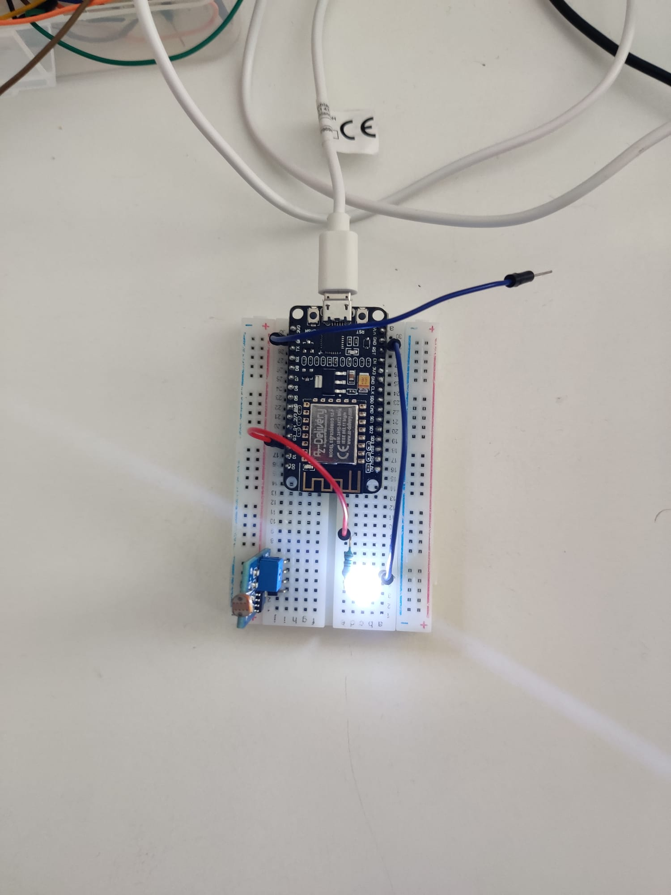

# ZQ Programmierung für das IoT - AFBB Dresden
11.-15.07.2022 Clemens Hanschmidt, Alexander Lorz

# Lernziele
Nach Abschluss dieses einwöchigen Praktikums sind Sie in der Lage:
* Im Team gemeinsam eine komplexe informationstechnische Aufgabenstellung zu bearbeiten, Lösungskonzepte zu entwickeln, diese zu dokumentieren und prototypisch umzusetzen.
[ ]
* Die dazu notwendigen Teilaufgaben eingenständig zu identifizieren und über mehrere Entwicklungsgruppen und -phasen zu verteilen und koordinieren.
[ ]
* Grundlegende Konzepte und Architekturmerkmale des Internet of Things zu benennen und deren Bedeutung für die Entwicklung eines komplexen IT-Systems darzustellen.
[ ]
* Verbreitete Technologien und Protokolle für ein einfaches IoT-System auszuwählen und zu benutzen und dafür Schnittstellen zwischen Systemkomponenten zu entwerfen und umzusetzen.
[ ]
* Ein oder mehrere einfache Constrained-Devices sowie die passenden Backend-Infrastruktur zu dessen Entwicklung und Betrieb zu konzipieren und umzusetzen.
[ ]

# Ziel 1: WLAN einrichten + Dinge ausprobieren
* [x] WLAN einrichten

## Dokumentieren:
* [x] Vereinbarung zur Vergabe von IP-Adressen - welche Gruppe benutzt welche Ranges?
> 100-119 Orange\
> 120-139 Blau\
> 140-159 Violett
* [x] Vereinbarung welcher Bereich IP-Adressen automatisch vergibt
> 20-99
* [x] Vereinbarung welcher Bereich für reservierte Geräte
> 1-19\
> 1 - WappyBoi
* [x] Netzwerkmeister
> Marc

# Ziel 2: Vorhandene Geräte mit MQTT steuern

# Ziel 3: Raspberry Pi einrichten
* [x] Installieren von Raspberry Pi OS Lite (32-bit)
* [x] Hostname vergeben - Raspiboi
* [x] SSH-Zugang ermöglichen
* [x] Root-Passwort vergeben - 

* [x] Administratorpasswort - 
* [x] Statische IP - 192.168.178.141 WLAN, 192.168.178.140 LAN
* [x] Zeitzonen usw anpassen
* [x] Update/Aktualisierung

## Probleme
* Raspberry Pi war jedes Mal nachdem man ihm eine statische IP (bei folgendem Reset)
> seemingly random, weil es immer wieder mal funktioniert hatte\
> bei Installation des IOTStacks kam der Fehler dann wieder\
> Lösung durch Hr. Dr. Lorz
* später wieder Fehlschlag des Raspberry Pi
* Durch Fehlschlag bei allen Gruppen an verschiedenen Punkten wurde eine Ersatzlösung durchgplant zur Durchführung gestartet (weiter in 3a)

# Ziel 3a: Ausweich auf Debian-Laptop
Aufgrund der Ausfälle unseres Raspberry Pi 5s haben wir die Entscheidung getroffen, dass wir diesen umgehen und einen Laptop frisch auf Debian booten und diesen als Pseudo-Pi zu nutzen

* Bestehenden Laptop plätten und neu booten
> Debian Version - 11.04\
> BootStick Erstellung per [Rufus](https://rufus.ie/de/)

* Daten:
> Real Name: lila\
> Username: pi\
> Password: pi

* Eine Partition, alles dort drin

# Ziel 4: IOTStack installieren und einrichten
[Link zum Tutorial](https://sensoriot.github.io&/IOTStack/Basic_setup)

* Bestandteile:
> [x] Grafana\
> [x] Influxdb\
> [x] Mosquitto\
> [x] NodeRed\
> [x] Portainer-CE

* Ports:
> 3000 - Grafana
>> username: admin\
>> password: admin
>>
> 1880 - NodeRed\
> 9000 - Portainer
>> username: \
>> password: \

## Probleme

# Ziel 5: IoT-Grundlagen präsentieren und erklären können
* [Link zur Präsentation](https://docs.google.com/presentation/d/1OA43oWYI0IdfKxGPRfhTF-xS5oXf_kllf4pKpVWIIzA/edit?usp=sharing)
> Vortrag ausgearbeitet von Sebastian\
> Vortrag gehalten von Sebastian

# Ziel 6: Ein eigenes IoT-Device bauen
**Stimmen Sie sich im Team ab, welche Aufgabe Sie lösen wollen. Falls Sie genügend Zeit zur Verfügung haben können Sie mehrere Geräte bauen bzw. die Aufgabenstellung in Abstimmung mit den Betreuern verändern** Die Aufgabe 6a kennen Sie vielleicht schon aus den ZQs der letzten Jahre. Sie erfordert (ein klein wenig) mehr Aufwand beim Dimensionieren und Umsetzen einer Schaltung zum Anschluss einer einfachen einfarbigen Lichterkette. 6b ist bezüglich der Hardware sehr einfach, erfordert aber eine selbstständigerere Einarbeitung. Bei 6c können Sie Ihrer Kreativität freien Lauf lassen (soweit wir die dafür notwendige Hardware da haben).

## Ziel 6a: Einfarbiges Tasmota-SmartLight mit ESP8266
* Breadboard aufbau für LED-Test:\

* Anfängliche Probleme, LED leuchtete nur bei direkter Stomzuvor über Anschlüsse "3V3"
> Tasmota war auf ESP8266 nicht installiert

* Installation von Tasmota nach Anleitung
> Anleitung auf Linux ausgelegt, kein Schritt funktionierte für uns

* Umgehungsvariante auf Software "Tasmotizer" @Theodor
> ESP8266 wurde nicht erkannt, weil kein Treiber installiert

* Installation Treiber
> keine automatische Suche der Treiber möglich, manuelle installation notwendig

* Installation über Tasmotizer erfolgreich
* Konfiguration
> Template laut Anleitung funktionierte nicht, gewähltes Template:

* LED-Steuerung über "LED" oder "LED_i" war nicht möglich
> anderes Profil notwendig:

## Lessons Learned
* Anleitung war für uns basically useless, weil es für Linux gemacht war.
> nach nichts arbeiten, was man nicht selbst gemacht/geprüft/durchgegangen ist.

* Murphys Gesetze sind wahr.
* Arbeitsaufteilung war an manchen Stellen leider nicht so gut
> lag primär an der andauernden Fehlschläge und Sackgassen.

## Ziel 6b: WLED-SmartLight mit mehrfarbigen LEDs
Machen Sie sich selbstständig mit dem Projekt [WLED](https://kno.wled.ge/basics/gettings-started/) vertraut und steuern Sie mit einem ESP32 oder ESP8266 einen mehrfarbigen LED-Streifen an. Beachten Sie die Strombegrenzung des Netzteils, und stimmen Sie sich vor der Inbetriebnahme mit den Betreuern ab bzw. bitten Sie diese um Unterstützung wenn Sie nicht weiterkommen.

## Ziel 6c: Einbindung weiterer Sensoren oder Aktoren
Stimmen Sie sich mit den Betreuern ab, welche weiteren Sensoren oder Aktoren (z.B. Schalter, Feuchtigkeits- oder Lichtsensoren, Servos, ...) sie per MQTT abfragen bzw. steuern wollen. Unterbreiten Sie Lösungsvorschläge, wie diese z.B. mit Tasmota angeschlossen werden können.

# Ziel 7: Nutzung mit NodeRed und MQTT
Machen Sie sich mit NodeRed und MQTT vertraut, finden SIe passende Internetquellen und erstellen Sie teamübergreifend einen kurzen Vortrag (ca. 5-10 Minuten) mit dem Sie eine Einführung in MQTT geben können.
> Vortrag ausgearbeitet von Marc, Florian und Nils\
> Vortrag gehalten von Nils\
> beinhält eine Grundsatzerklärung von MQTT, NodeRed und einer kleinen Beispieldarstellung von NodeRed anhand eines CO2 Sensors

# Ziel 8: Abschlusspräsentation
Stellen Sie Ihre Ergebnisse und Lernerfolge in einer Abschlusspräsentation vor